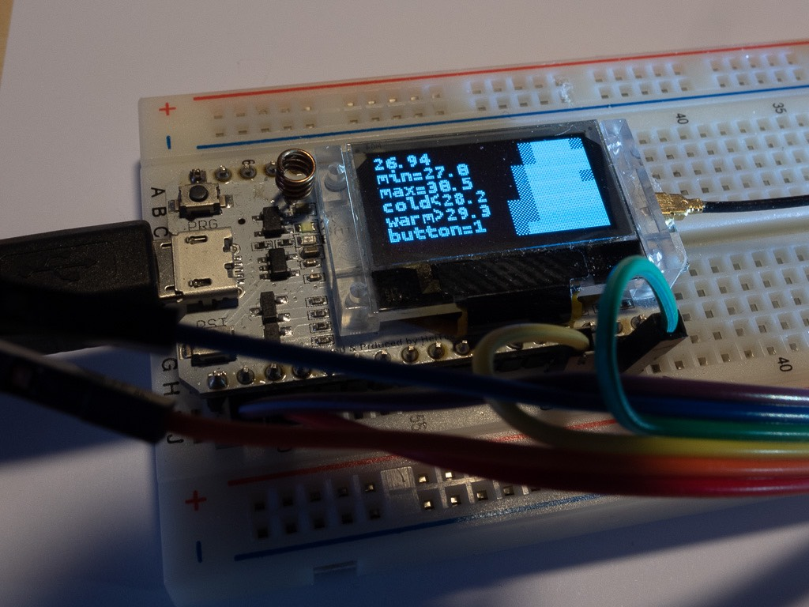

# Simple Micropython Class for Controlling AMG8833 8x8 Pixel Grid-Eye 

## Motivation

Several different modules are available for AMG8833 but either for the Arduino Plattform or for Circuitpython by Adafruit but not specific for the ESP32 Micropython. 

So I wrote this simple class plus an example program based on the Micropython version provided by Loboris ([https://github.com/loboris/MicroPython_ESP32_psRAM_LoBo](https://github.com/loboris/MicroPython_ESP32_psRAM_LoBo))

Please note that I'm a newbie in python - so I'm quite sure that the class and the test program could be optimized!

## My Implementation

The AMG8833 mainly supports 3 functions

1) 8x8 Grid to measure temperature of 64 pixel

2) precise temperature measurement with thermistor

3) interrupt generation in case temperature of one or more pixel is under and/or over a certain limit

My class supports functions 1 and 2 only. Function 3 might be added later

## Sample app

Written for __Heltec-Lora-ESP32__ module with integrated OLED display (and currently unused Lora Module).

* __AMG8833.py__ class for AMG8833
* __test_amg.py__ example program
* __mono12.py__ font file 
* __writer.py__ writer class for OLED SSD1306

### usage

* reboot your ESP32
* transfer all files to your ESP32 (eg. with ampy)
* type ´´´import test_amg´´´
* you should then see the same screen output as shown in my picture

### graphical display

Unfortunately the OLED Display is black and white so, instead of colors I used 3 different shades:
* 0% for cold temperatures (coldest value + 1/3 of span to warmest value)
* 100% for warm temperatures (warmest value - 1/3 of span)
* 50% for in between

### wiring

connect GND to GND (three pins on __Heltec__)
connect VIN to 3.3V (two pins on __Heltec__)
connect SDA to pin 4 (same SDA as SSD1306)
connect SCL to pin 15 (same SCL as SSD1306)

